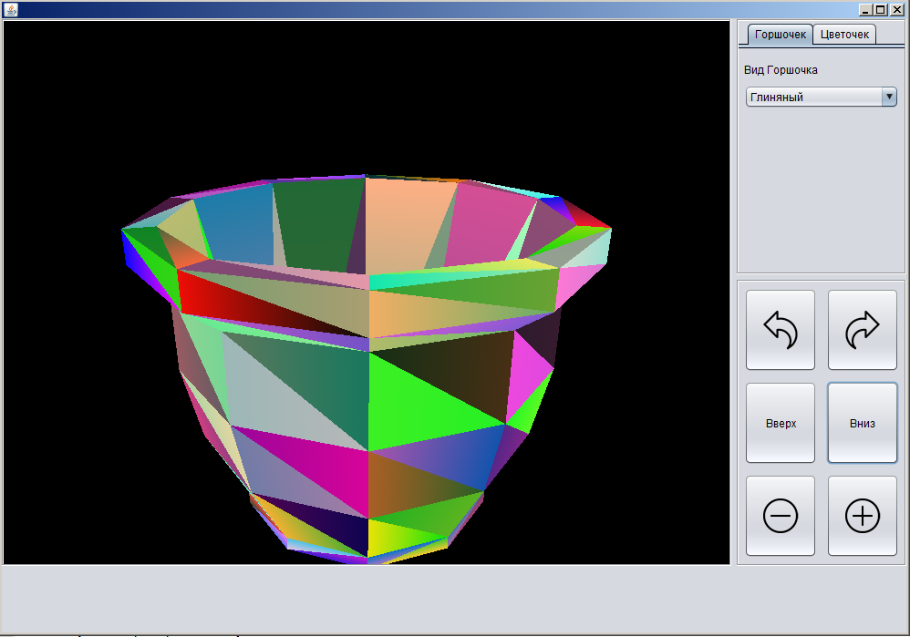

An Example of using JOGL with SWING panel for reading and rendering STL (ASCII) files.

A model files: clay_pot.stl and square _pot.stl are used here as data sources for rendering and they should be available.

